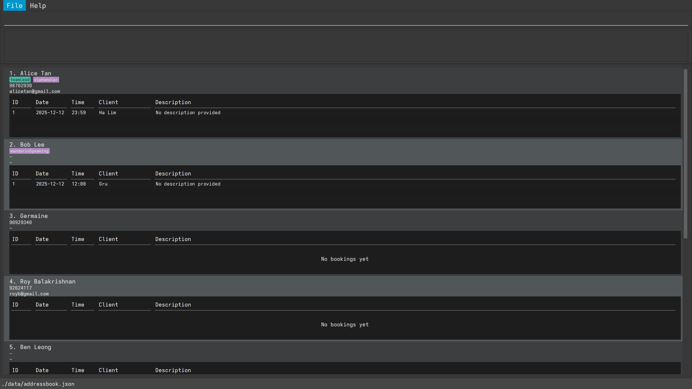

This project is based on the AddressBook-Level3 project created by the [SE-EDU initiative](https://se-education.org).

# FirstImpressions

This product helps leaders to keep track of their team of relationship professionals’ strengths, along with their schedules. With FirstImpressions, no client request is too hard to handle as our system is able to search through multiple preferences, ensuring the perfect match for our customers.
