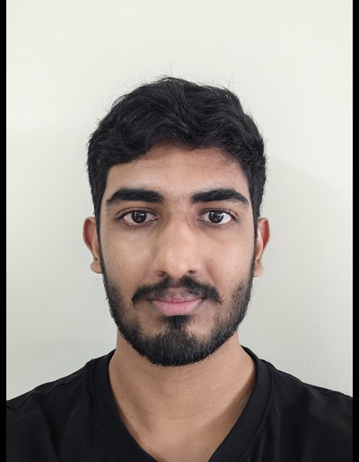
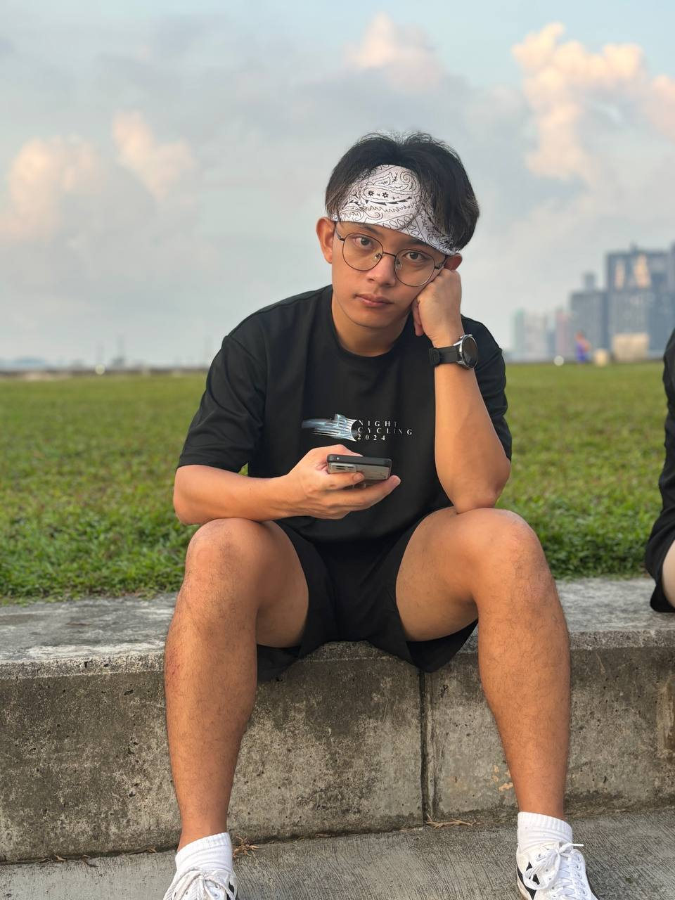
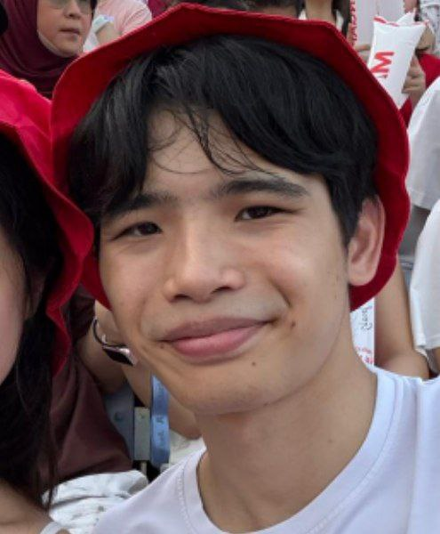

We are a CS2103T team based in the [School of Computing, National University of Singapore](https://www.comp.nus.edu.sg).

## Project team

### Abhijay

[[homepage](http://www.comp.nus.edu.sg/~damithch)]
[[github](https://github.com/abhijay25)]
[[portfolio](team/johndoe.md)]

* Role: Developer
* Responsibilities: Integration

### Ian Chin

[[homepage](http://www.comp.nus.edu.sg/~damithch)]
[[github](https://github.com/ianchinn)]
[[portfolio](team/johndoe.md)]

* Role: Developer
* Responsibilities: Testing, Code Quality

### Alson Lee

[[homepage](http://www.comp.nus.edu.sg/~damithch)]
[[github](https://github.com/alsonleej)]
[[portfolio](https://alson-portfolio.vercel.app/)]

* Role: Developer
* Responsibilities: Scheduling and Tracking, Deliverables and Deadlines

### Tan Athan

[[homepage](http://www.comp.nus.edu.sg/~damithch)]
[[github](https://github.com/tathan08)]
[[portfolio](team/johndoe.md)]

* Role: Team Lead
* Responsibilities: Documentation
