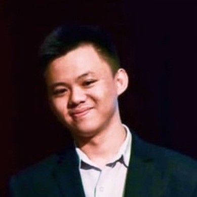

We are a CS2103T team based in the [School of Computing, National University of Singapore](https://www.comp.nus.edu.sg). 

## Project team

### Alson Lee

[[github](https://github.com/alsonleej)]
[[portfolio](https://alson-portfolio.vercel.app/)]

* Role: Developer
* Responsibilities: Scheduling and Tracking, Deliverables and Deadlines

### Jane Doe

[[github](http://github.com/johndoe)]
[[portfolio](team/johndoe.md)]

* Role: Team Lead
* Responsibilities: UI

### Johnny Doe

[[github](http://github.com/johndoe)] [[portfolio](team/johndoe.md)]

* Role: Developer
* Responsibilities: Data

### Jean Doe

[[github](http://github.com/johndoe)]
[[portfolio](team/johndoe.md)]

* Role: Developer
* Responsibilities: Dev Ops + Threading

### James Doe

[[github](http://github.com/johndoe)]
[[portfolio](team/johndoe.md)]

* Role: Developer
* Responsibilities: UI
