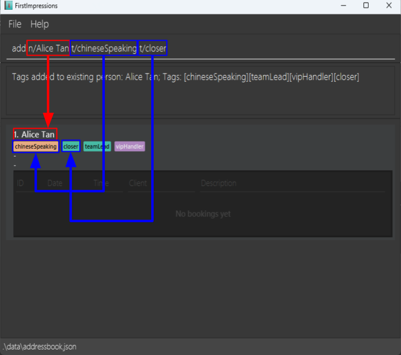
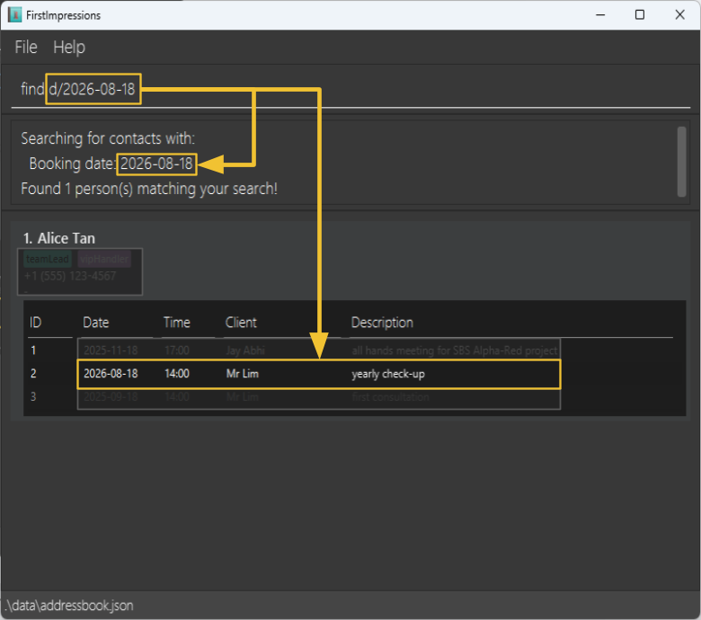
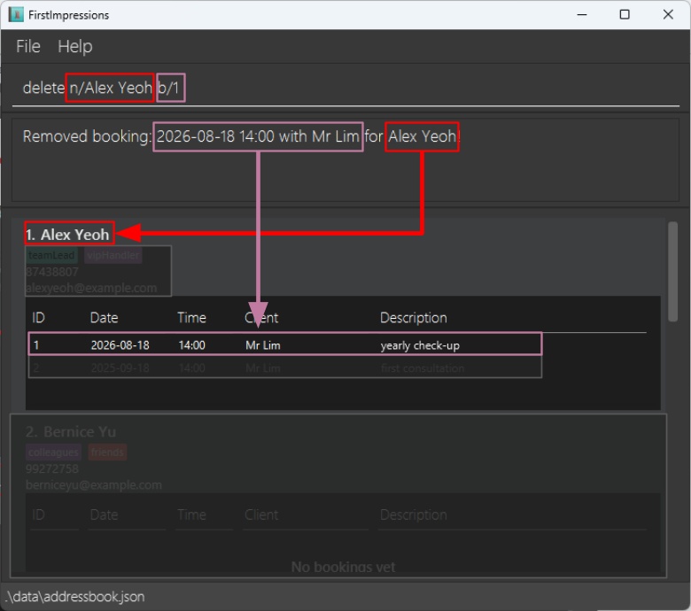
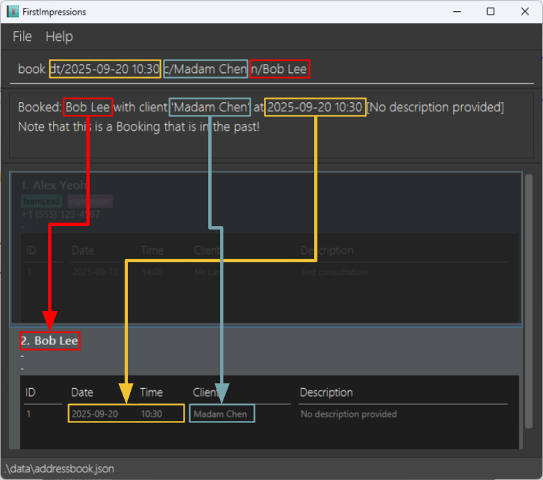

<div class="print-toc" markdown="1">

## Table of Contents

- [Table of Contents](#table-of-contents)
- [Introduction](#introduction)
  - [Target Users](#target-users)
  - [User Proficiency Level](#user-proficiency-level)
  - [What FirstImpressions Does](#what-firstimpressions-does)
- [Quick start](#quick-start)
  - [Prerequisites](#prerequisites)
  - [Installation Steps](#installation-steps)
- [Features](#features)
  - [Viewing help : `help`](#viewing-help--help)
  - [Adding a person: `add`](#adding-a-person-add)
  - [Adding tags to an existing person: `add`](#adding-tags-to-an-existing-person-add)
  - [Listing all persons : `list`](#listing-all-persons--list)
  - [Editing a person : `edit`](#editing-a-person--edit)
  - [Searching for persons or bookings : `find`](#searching-for-persons-or-bookings--find)
  - [Deleting a person : `delete`](#deleting-a-person--delete)
  - [Clearing all entries : `clear`](#clearing-all-entries--clear)
  - [Assigning a booking : `book`](#assigning-a-booking--book)
  - [Exiting the program : `exit`](#exiting-the-program--exit)
- [Data Management](#data-management)
  - [Saving the data](#saving-the-data)
  - [Editing the data file](#editing-the-data-file)
- [FAQ](#faq)
- [Known Issues](#known-issues)
- [Command Summary](#command-summary)

</div>

## Introduction

**FirstImpressions** is a **desktop app for managing contacts, optimized for use via a Command Line Interface** (CLI) while still having the benefits of a Graphical User Interface (GUI).

### Target Users
- **Team leaders and managers** who need to coordinate relationship professionals
- **Business professionals** who manage client relationships and appointments
- **Users comfortable with command-line interfaces** who prefer efficiency over graphical navigation

### User Proficiency Level
This application is designed for users who:
- Are comfortable with basic computer operations
- Can navigate using keyboard commands
- Have experience with command-line interfaces or are willing to learn
- Need efficient contact and appointment management tools

### What FirstImpressions Does
FirstImpressions helps you:
- **Manage your team of relationship professionals** by storing their contact information, skills, and specializations
- **Track client appointments and bookings** with detailed scheduling capabilities
- **Search and filter team members** by name, skills, or availability
- **Organize team members** with customizable tags and categories
- **Ensure perfect client-professional matches** through comprehensive search capabilities

With FirstImpressions, no client request is too hard to handle as our system is able to search through multiple preferences, ensuring the perfect match for our customers.

--------------------------------------------------------------------------------------------------------------------

## Quick start

### Prerequisites

1. **Ensure you have Java 17 or above installed in your Computer.**

   <div markdown="span" class="alert alert-info">:information_source: **Java Installation Guide:**

   **Windows users:** Download Java 17 from [Oracle's official website](https://www.oracle.com/java/technologies/javase/jdk17-archive-downloads.html) or use [OpenJDK 17](https://adoptium.net/temurin/releases/?version=17).

   **Mac users:** Ensure you have the precise JDK version prescribed [here](https://se-education.org/guides/tutorials/javaInstallationMac.html).

   **Linux users:** Install OpenJDK 17 using your package manager:
   - Ubuntu/Debian: `sudo apt install openjdk-17-jdk`
   - CentOS/RHEL: `sudo yum install java-17-openjdk-devel`
   - Arch Linux: `sudo pacman -S jdk17-openjdk`
   </div>

2. **Verify Java Installation:** <span id="verify-java"></span>
   Open a command terminal as follows:
   - On Windows, press the Windows key on your keyboard, and type in cmd
   - On Mac, press the Command + Space keys at the same time, and type in terminal
   - On Linux, press the Control + Alt + T keys at the same time.

   Then in your terminal, run:
   ```
   java -version
   ```
   You should see output similar to:
   ```
   openjdk version "17.0.x" 2023-xx-xx
   OpenJDK Runtime Environment (build 17.0.x+x)
   OpenJDK 64-Bit Server VM (build 17.0.x+x, mixed mode, sharing)
   ```

### Installation Steps

Step 1: **Download the latest `.jar` file** from [here](https://github.com/AY2526S1-CS2103T-T08-4/tp/releases).

Step 2: **Copy the file** to the folder you want to use as the _home folder_ for the app.

<div markdown="span" class="alert alert-warning">:exclamation: **Warning:**
Do not move the .jar file after data has been created. The application stores data relative to the .jar file location. Moving it may cause loss of access to your data.
</div>

Step 3: **Run the application**

   - Open your command terminal, [as follows](#verify-java)
   - Navigate to the folder: `cd /path/to/your/folder`
   - Run: `java -jar firstimpressions.jar`

Step 4: **Verify successful launch:** <br>
A GUI similar to the below should appear in a few seconds. Note how the app contains some sample data.<br>

<div markdown="span" class="alert alert-primary">:bulb: **Tip:** If the application doesn't start, ensure Java 17+ is properly installed and the .jar file is not corrupted.</div>

<div markdown="span" class="alert alert-warning">:exclamation: **Important:**
Always backup your `addressbook.json` file before making major changes. Data loss cannot be recovered without a backup.
</div>

Step 5: **Try your first commands** <br>
Type the command in the command box and press Enter to execute it. e.g. typing **`help`** and pressing Enter will open the help window.<br>
   Some example commands you can try:

   * `list` : Lists all contacts.

   * `add n/Alice Tan p/98765432 e/alicetan@gmail.com t/vipHandler` : Adds a contact named `Alice Tan` to the list of contacts.

   * `delete n/Alice Tan` : Deletes the contact named Alice Tan from the whole list of contacts.

   * `clear f/` : Deletes all contacts.

   * `exit` : Exits the app.

Step 6: **Explore more features** <br>
Refer to the [Features](#features) below for details of each command.

--------------------------------------------------------------------------------------------------------------------

## Features

<div markdown="block" class="alert alert-info">

**:information_source: Notes about the command format:**<br>

* Words in `UPPER_CASE` are the parameters to be supplied by the user.<br>
  e.g. in `add n/PERSON_NAME`, `PERSON_NAME` is a parameter which can be used as `add n/Alice Tan`.

* Items in square brackets are optional.<br>
  e.g `n/PERSON_NAME [t/TAG]` can be used as `n/Alice Tan t/vipHandler` or as `n/Alice Tan`.

* Items with `…`​ after them can be used multiple times including zero times.<br>
  e.g. `[t/TAG​]…` can be used as ` ` (i.e. 0 times), `t/vipHandler`, `t/vipHandler t/teamLead` etc.

* Extraneous parameters for commands that do not take in parameters (such as `help`, `list`, and `exit`) will be ignored.<br>
  e.g. if the command specifies `help 123`, it will be interpreted as `help`.

* If you are using a PDF version of this document, be careful when copying and pasting commands that span multiple lines as space characters surrounding line-breaks may be omitted when copied over to the application.
</div>

### Viewing help : `help`

Shows a short summary of available commands, with a link to access the User Guide.

 <br>
*Figure 1: Help window showing available commands and User Guide's link*

Format: `help`


### Adding a person: `add`

Adds a person to the contact list.

Format: `add n/NAME [p/PHONE_NUMBER] [e/EMAIL] [t/TAG]…​`

* Consecutive spaces in name are removed. e.g. "Alice&nbsp;&nbsp;&nbsp;&nbsp;&nbsp;Tan" will be saved as `Alice Tan`.
* Names can contain letters, spaces, apostrophes, hyphens, and slashes. e.g. `s/o` (son of), `d/o` (daughter of).

<div markdown="span" class="alert alert-warning">:exclamation: **Warning:**
Duplicate names are not allowed. Each person in the contact list must have a unique name. <br>
In this case, try customising the names in a way that is easily identifiable to you! <br>
For example: Alice Tan - Glasses, Alice Tan - No Glasses
</div>

<div markdown="span" class="alert alert-warning">:exclamation: **Warning:**
Tags must contain only letters and numbers (no spaces, hyphens, or special characters)! <br>
Try using camelCase for multi-word tags! (e.g. `vipHandler`, instead of `vip-handler` or `vip handler`)
</div>

<div markdown="span" class="alert alert-info">:information_source: **Character Limits:** <br>
* Names: Maximum 100 characters (must start with a letter) <br>
* Phone: Can contain any characters (numbers, +, (), -, spaces, letters, etc.), but cannot be spaces only. <br>
* Email: Must be a valid email format (username@domain.com) <br>
* Tags: Letters and numbers only <br>
</div>

Examples:

* `add n/Germaine` <br> will add a Person called `Germaine` to the contact list.


* `add n/Alice Tan t/teamLead t/vipHandler` <br> will add a Person called `Alice Tan` with tags `teamLead` and `vipHandler` to the contact list. <br>
 <br>
*Figure 2: Adding a new person to the contact list*

### Adding tags to an existing person: `add`

Adds tags to an existing person.

Format: `add n/NAME t/TAG…​`

* Consecutive spaces in name are removed. e.g. "Alice&nbsp;&nbsp;&nbsp;&nbsp;&nbsp;Tan" will be read as `Alice Tan`.
* Multiple tags can be added at once by prefixing each tag with `t/`.
* Tags must contain only letters and numbers, without spaces.
* If person does not already exist in FirstImpressions, the person is created.

<div markdown="span" class="alert alert-warning">:exclamation: **Warning:** Names used here must be case-sensitive! <br>
`add n/Alice tan t/closer` will not add tags to `Alice Tan`. Use the exact name as shown in the contact list. <br>
If the name does not match a current name in the contact list, a new Person will be created.
</div>

Examples:

* `add n/Alice Tan t/chineseSpeaking t/closer` <br> will add, to an existing Person `Alice Tan`, the tags `chineseSpeaking` and `closer`. It will be added onto her current tags <br>
 <br>
*Figure 3: Success message after adding tags to an existing person*

### Listing all persons : `list`

Shows the list of all persons in the contact list.

Format: `list`


*Figure 4: Contact list showing all persons in the address book*

### Editing a person : `edit`

Edits an existing person in the contact list.

Format: `edit n/OLD_NAME [n/NEW_NAME] [p/PHONE] [e/EMAIL] [t/TAG]…​`

* Edits the person identified by `OLD_NAME`. The name must exactly match (case-sensitive) a current person in the contact list.
* At least one of the optional fields must be provided.
* Existing values will be updated to the input values.
* You can remove all the person's tags by typing `t/` without specifying any tags after it.

<div markdown="span" class="alert alert-warning">:exclamation: **Warning:**
Person names are case-sensitive. `edit n/john doe ...` will not edit `John Doe`. Use the exact name as shown in the contact list. <br>
If the person is not found, you will see the error: "Could not find anyone named 'john doe' in your address book. Please check the name and try again."
</div>

<div markdown="span" class="alert alert-warning">:exclamation: **Warning:**
When editing tags, the existing tags of the person will be **completely replaced** (not added to). <br>
If you want to keep existing tags, you must include them in the edit command. <br>
For example, if a person has tags `teamLead` and `sales`, using `edit n/John t/manager` will replace both tags with only `manager`. <br>
If you don't specify any changes, you'll see: "No changes specified! Please provide at least one field to edit (name, phone, email, or tags)."
</div>

Examples:
*  `edit n/John Doe p/91234567 e/johntan@gmail.com` <br>
Will edit the phone number and email address of the person named `John Doe` to be `91234567` and `johntan@gmail.com` respectively.
*  `edit n/John Doe n/Jane Doe t/` <br>
Will edit the name of `John Doe` to be `Jane Doe` and clears all of their existing tags.


*  `edit n/Alice Tan p/+1 (555) 123-4567` <br>
Edits the phone number of `Alice Tan` to be `+1 (555) 123-4567`. <br>
 <br>
*Figure 5: Success message after editing a person's details*

### Searching for persons or bookings : `find`

The `find` command offers a flexible way for users to filter the contact list by **name**, **tag**, and **scheduled date of bookings**. <br>

Format: <br>
`find n/NAME1 [n/NAME2]...` <br>
`find t/TAG1 [t/TAG2]...` <br>
`find d/DATE1 [d/DATE2]...` <br>


<div markdown="span" class="alert alert-warning">:exclamation: **Warning:**
Each search parameter must preceded by its respective delimeter.

If multiple tags are being searched for, each parameter must have its own `t/`  <br>
`find t/teamLead t/vipHandler` displays all persons with the `teamLead` tag **OR** the `vipHandler` tag
</div>

<div markdown="span" class="alert alert-primary">:bulb: **Tip:** Expand your search by utilizing different fields! <br>
`find n/Alice t/teamLead` displays all team members containing `Alice` in their name **OR** team members whose tags contain `teamLead` within them.
</div>

* Searching within a field with an empty parameter (e.g. `find n/`, `find t/` or `find d/`) will list all team members within FirstImpressions
* The search for names and tags are case-insensitive. e.g `hans` will match `Hans`
* Partial matches will be shown e.g. `find n/Ali` will find a person named `Alice`
* Date must be in `YYYY-MM-DD` format.

Examples:
* `find n/John` <br>
returns `john` and `John Doe`, or any other Person with 'john' in their name, case-insensitively.
* `find t/` <br>
returns all team members in FirstImpressions as it searches for 'any' tag.


* `find d/2026-08-18` <br>
returns `Alice Tan` as she has a Booking on 2026-08-18 14:00. <br>
 <br>
*Figure 6: Search results showing team members matching the search criteria*

### Deleting a person : `delete`

Remove a person from the contact list, or remove specific tag(s) from a person, or remove a specific booking from a person.

Format: `delete n/PERSON_NAME [t/TAG]…​ [b/BOOKING_INDEX]​`

* If only `n/PERSON_NAME` is provided, then the person is removed from the contact list.
* If both `n/PERSON_NAME` and `t/TAG` is provided, then the specific tag(s) will be removed.
* If both `n/PERSON_NAME` and `b/BOOKING_INDEX` is provided, then the specific booking will be removed.
* Only tags that currently belong to the person will be deleted.
* Booking indices refer to the booking number shown in the person's booking list (starting from 1) as shown in GUI.
* The name provided must exactly match (case-sensitive) a person in the contact list. e.g. `delete n/Alex` will not delete `Alex Yeoh`

<div markdown="span" class="alert alert-warning">:exclamation: **Warning:**
Person names are case-sensitive. <br>
`delete n/alice` will not delete `Alice Tan`. Use the exact name as shown in the contact list. <br>
If the person is not found, you'll see: "Could not find anyone named 'alice' in your address book. Please check the name and try again."
</div>

<div markdown="span" class="alert alert-warning">:exclamation: **Warning:**
You cannot use both `t/` (tags) and `b/` (bookings) in the same delete command. <br>
The command will fail with: "You can only delete either tags (t/) OR bookings (b/), not both at the same time!"
</div>

<div markdown="span" class="alert alert-warning">:exclamation: **Warning:**
Tag names cannot contain spaces. If you want to delete multiple tags, use separate `t/` prefixes. Example: `delete n/John t/friend t/colleague`. <br>
If you use spaces in a tag name, you'll see: "Tag names cannot contain spaces! If you want to delete multiple tags, use separate t/ prefixes."
</div>

Examples:
* `delete n/Alex t/vipHandler` <br>
will remove the tag `vipHandler` from `Alex` in the contact list.
* `delete n/Alex Yeoh` <br>
will remove `Alex Yeoh` from the contact list entirely.


* `delete n/Alex Yeoh b/1` <br>
will remove the first booking from `Alex Yeoh` in the contact list. <br>
 <br>
*Figure 7: Success message after deleting a person from the contact list*

### Clearing all entries : `clear`

Clears all entries from the contact list.

Format: `clear f/`

* The command `clear` without the `f/` flag will display a warning message and will NOT delete any data.
* You must use `clear f/` to confirm and execute the deletion of all contacts and bookings.
* We did this to prevent users from accidentally deleting all their important data!

<div markdown="span" class="alert alert-warning">:exclamation: **Warning:**
The `clear f/` command permanently deletes ALL contacts and bookings. This action cannot be undone. Make sure to backup your data before using this command.
</div>

<div markdown="span" class="alert alert-primary">:bulb: **Tip:**
If you accidentally type `clear`, don't worry! The system will show you a warning message instead of deleting your data. You must explicitly use `clear f/` to confirm the deletion.
</div>

Examples:
* `clear` - Shows a warning message without deleting any data <br>
 <br>
*Figure 8: Warning message after user types in `clear`*


* `clear f/` - Clears all entries from the contact list <br>
 <br>
*Figure 9: Success message after contact list has been cleared*


### Assigning a booking : `book`

Assigns a client meeting to a person at a given date and time, with an optional description.

Format: `book dt/DATETIME c/CLIENT_NAME n/PERSON_NAME [desc/DESCRIPTION]`

* Name of person provided must be in the current contact list.
* Client name can contain letters, numbers, spaces, apostrophes, hyphens, periods, and slashes. e.g. `s/o` (son of), `d/o` (daughter of). Must be 1-100 characters and contain at least one letter.
* Datetime must be in `YYYY-MM-DD HH:MM` format in 24-hour notation.
* The keyword (delimiter) here is `dt/` as it includes both date and time.

<div markdown="span" class="alert alert-info">:information_source: **Time Format:**
Time must be in 24-hour format (HH:MM). <br>
Use `14:00` for 2:00 PM, `09:00` for 9:00 AM. <br>
Minutes are required even for on-the-hour times (e.g., `10:00`, not `10`).
</div>

<div markdown="span" class="alert alert-info">:information_source: **Past Dates:**
Bookings can be created for past dates, for record-keeping purposes. <br>
When booking a past date, a warning message will be displayed: "Note that this is a Booking that is in the past!" to remind you that this appointment has already occurred.

Additionally, past bookings will appear greyed out (with reduced opacity) in the contact list to visually distinguish them from future appointments. <br>
The bookings are sorted with future bookings at the top (in chronological order) and past bookings at the bottom (also in chronological order).
</div>

<div markdown="span" class="alert alert-warning">:exclamation: **Warning:**
Dates must be valid calendar dates. <br>
Invalid dates like 2026-02-31 will be rejected with: "Invalid date/time format or value! Please use the format: YYYY-MM-DD HH:MM (e.g., 2024-12-25 14:30)."
</div>

Examples:

* `book dt/2020-10-26 17:00 c/Mr Lim n/Alice Yeoh desc/backdated` <br>
will create a booking for a past date (26th October 2020). <br>
The result message will be: "Booked: Alice Yeoh with client 'Mr Lim' at 2020-10-26 17:00 [backdated]. Note that this is a Booking that is in the past!"


* `book dt/2025-09-20 10:30 c/Madam Chen n/Bob Lee` <br>
will assign a booking on 20th September 2025 10.30am to Bob Lee. The client will be Madam Chen. <br>
 <br>
*Figure 10: Success message after creating a new booking*

<div markdown="span" class="alert alert-warning">:exclamation: **Warning:**
Double booking is not allowed! <br>
If you try to add a Booking to someone who's busy at the same date and time, you'll see: "This person already has a booking at this time. Please choose a different time slot."
</div>

### Exiting the program : `exit`

Exits the program.

Format: `exit`

## Data Management

### Saving the data

FirstImpressions data are saved in the hard disk automatically after any command that changes the data. There is no need to save manually.

### Editing the data file

FirstImpressions data are saved automatically as a JSON file `[JAR file location]/data/addressbook.json`. Advanced users are welcome to update data directly by editing that data file.

<div markdown="span" class="alert alert-warning">:exclamation: **Caution:**
If your changes to the data file makes its format invalid, FirstImpressions will discard all data and start with an empty data file at the next run. Hence, it is recommended to take a backup of the file before editing it.<br>
Furthermore, certain edits can cause the FirstImpressions to behave in unexpected ways (e.g., if a value entered is outside of the acceptable range). Therefore, edit the data file only if you are confident that you can update it correctly.
</div>

## FAQ

**Q**: How do I transfer my data to another Computer?<br>
**A**: Install the app in the other computer and overwrite the empty data file it creates with the file that contains the data of your previous FirstImpressions home folder (your `addressbook.json` file from the `data` folder).

**Q**: Can I use FirstImpressions without an internet connection?<br>
**A**: Yes, FirstImpressions is a desktop application that works completely offline. All your data is stored locally on your computer.

**Q**: What happens if I accidentally delete a person?<br>
**A**: Unfortunately, there is no built-in undo feature. However, you can restore your data by copying a backup of your `addressbook.json` file from the `data` folder.

**Q**: What happens if I accidentally type `clear`?<br>
**A**: Don't worry! The system will show you a warning message without deleting any data. You must explicitly use `clear f/` with the force flag to confirm the deletion of all contacts.

**Q**: Can I import contacts from other applications?<br>
**A**: Currently, FirstImpressions does not support direct import from other applications. You would need to manually add contacts using the `add` command.

**Q**: Is there a limit to the number of contacts I can store?<br>
**A**: There is no hard limit, but performance may decrease with very large datasets (thousands of contacts). The application is optimized for typical business use cases.

**Q**: Can I customize the date and time format?<br>
**A**: No, the application uses a fixed format: `YYYY-MM-DD HH:MM` for dates and times. This ensures consistency across all users.

**Q**: What if I forget the exact name of a person when using delete or edit commands?<br>
**A**: Use the `find` command first to locate the person, then use the exact name shown in the results for delete or edit operations.

**Q**: Can I book multiple appointments for the same person at different times?<br>
**A**: Yes, you can book multiple appointments for the same person as long as they are at different times. The system prevents double booking at the same time.

**Q**: How do I backup my data?<br>
**A**: Simply copy the `addressbook.json` file from the `data` folder in your FirstImpressions directory. Store this backup in a safe location.

**Q**: What should I do if the application crashes or won't start?<br>
**A**: First, ensure Java 17+ is properly installed. If the problem persists, try deleting the `preferences.json` file and restarting the application. If data corruption is suspected, restore from a backup of your `addressbook.json` file.

**Q**: What phone number formats are supported?<br>
**A**: Phone numbers are very flexible in FirstImpressions! You can use any format including:
- Plain numbers: `98765432`
- International format: `+65 9123 4567`
- With parentheses and hyphens: `(123) 456-7890`
- With extensions: `123-456 ext. 789`
- Mixed format: `+1 (555) 123-4567`

The only restriction is that phone numbers cannot be empty or contain only whitespace.
If you do want an empty phone number, set the phone number to "-"!

--------------------------------------------------------------------------------------------------------------------

## Known Issues

1. **When using multiple screens**, if you move the application to a secondary screen, and later switch to using only the primary screen, the GUI will open off-screen. The remedy is to delete the `preferences.json` file created by the application before running the application again.
2. **If you minimize the Help Window** and then run the `help` command (or use the `Help` menu, or the keyboard shortcut `F1`) again, the original Help Window will remain minimized, and no new Help Window will appear. The remedy is to manually restore the minimized Help Window.

--------------------------------------------------------------------------------------------------------------------

## Command Summary

Action | Format, Examples
--------|------------------
**Help** | `help`
**Add** | `add n/NAME [p/PHONE_NUMBER] [e/EMAIL] [t/TAG]…​` <br> e.g., `add n/Alice Tan p/98702930 e/alicetan@gmail.com t/teamLead t/vipHandler`
**List** | `list`
**Edit** | `edit n/OLD_NAME [n/NEW_NAME] [p/PHONE_NUMBER] [e/EMAIL] [t/TAG]…​`<br> e.g.,`edit n/John Doe n/Jane Doe p/91234567 e/janedoe@example.com`
**Find** | `find n/NAME` or `find t/TAG1 [t/TAG2]…` or `find d/DATE1 [d/DATE2]…`<br> e.g., `find n/John` or `find d/2025-08-18`
**Delete** | `delete n/PERSON_NAME [t/TAG]…​ [b/BOOKING_INDEX]…​`<br> e.g., `delete n/Alex Yeoh` or `delete n/Alex t/vipHandler` or `delete n/Alex Yeoh b/1`
**Clear** | `clear f/`
**Book** | `book dt/DATETIME c/CLIENT_NAME n/PERSON_NAME [desc/DESCRIPTION]` <br> e.g., `book dt/2025-09-18 14:00 c/Mr Lim n/Alice Tan desc/first consultation`
**Exit** | `exit`
